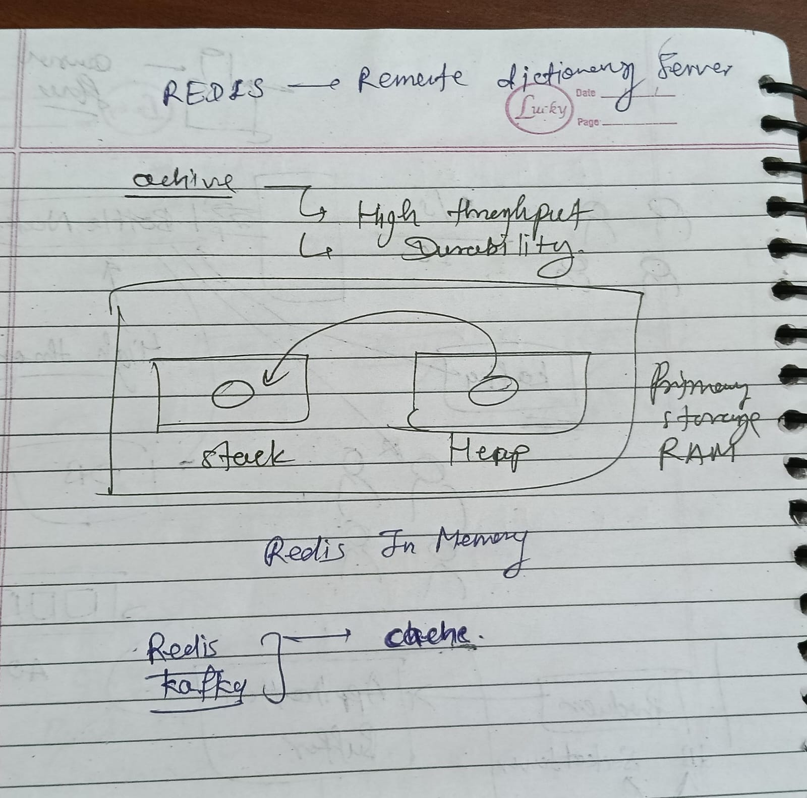
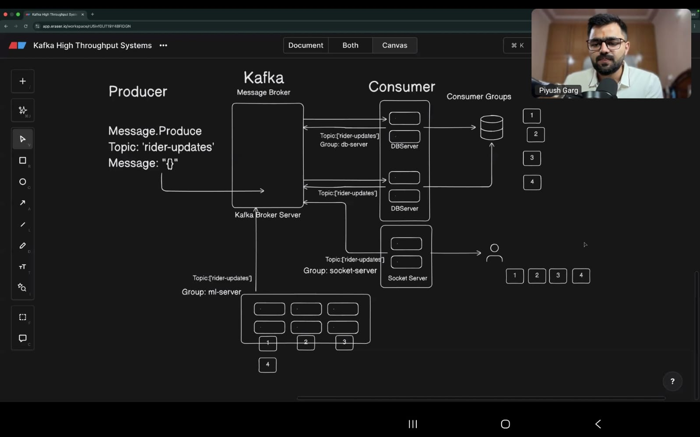
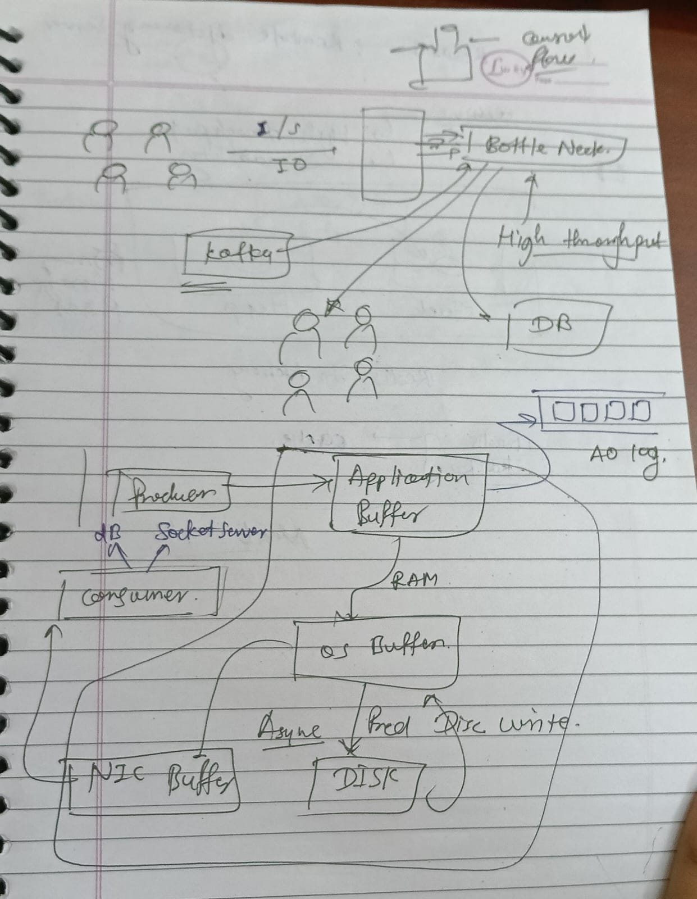

# Real-Time Rider Tracking Application

## 📋 Project Overview

This project is a **real-time rider tracking application** built with modern full-stack technologies. It allows users to track rider locations in real-time on an interactive map with live updates every 10 seconds. The application uses a message-driven architecture with **Kafka** as the backbone for handling high-throughput location updates across multiple server instances and databases.

### Key Features

- ✅ Real-time rider location tracking on interactive map
- ✅ Socket.IO integration for live bi-directional communication
- ✅ Kafka-based message queue for scalable event processing
- ✅ Multi-database synchronization using consumer groups
- ✅ Health check endpoint for monitoring
- ✅ Leaflet map integration for geolocation visualization
- ✅ Consumer group partition-based load balancing
- ✅ Docker Compose setup for easy deployment

---

## 🎓 What I Learned

### 1. **Kafka Fundamentals**

- **Zero-Copy Consumer Reading**: Kafka efficiently handles message consumption without unnecessary data copying
- **Consumer Groups**: Multiple consumers can work together with a unique `groupId`, enabling load balancing and fault tolerance
- **Partitions**: Critical for parallel processing - each partition can be consumed by a separate consumer, increasing throughput and maintaining message order
- **Topics**: Logical channels for messages (e.g., `location-updates` topic with 2 partitions)

### 2. **Real-Time Communication**

- Socket.IO for establishing persistent WebSocket connections
- Event-driven architecture using `io.emit()` and `socket.on()` listeners
- Real-time data synchronization across multiple clients

### 3. **Distributed Systems Architecture**

- How to synchronize the same record across multiple database instances
- Load balancing strategies using Kafka consumer groups
- High-throughput system design patterns
- Message broker role in decoupling producers and consumers

### 4. **Node.js & Express**

- Creating HTTP servers with proper middleware setup
- Integrating Socket.IO with Express and HTTP servers
- Building RESTful health check endpoints

### 5. **Geolocation & Maps**

- Using Leaflet library for interactive map rendering
- Getting user's current location via browser Geolocation API
- Real-time marker updates on the map

---

## 🏗️ Architecture Overview

### System Architecture Diagram

```
                         ┌─────────────────────────────┐
                         │   Multiple Rider Clients    │
                         │  (8 users with location)    │
                         └────────────┬────────────────┘
                                      │
                    ┌─────────────────▼────────────────┐
                    │  Producer (1/5 throughput)      │
                    │  Sends location updates         │
                    └────────────────┬────────────────┘
                                     │
         ┌──────────────────────────▼──────────────────────────────┐
         │         KAFKA MESSAGE BROKER (High Throughput)          │
         │                                                          │
         │  Topic: 'location-updates'                             │
         │  ├─ Partition 1 ────┐                                  │
         │  ├─ Partition 2 ────┼──────► Bottle Neck ─────┐       │
         │  ├─ Partition 3 ────┤                          │       │
         │  └─ Partition 4 ────┘                          │       │
         └──────────────────────────────────────────────────────────┘
                                                          │
         ┌───────────────────┬──────────────────┬─────────▼──────────────┐
         │   Application     │   OS Buffer      │   Socket Server       │
         │   Buffer (RAM)    │                  │   (Event Emitter)     │
         ├───────────────────┼──────────────────┼──────────────────────┤
         │  • Caching        │  • Memory        │  • Real-time Events  │
         │  • Buffering      │    Management    │  • Consumer Groups   │
         │                   │                  │                       │
         └───────────────────┴──────────────────┴──────────────────────┘
                                      │
         ┌────────────────────────────▼────────────────────────────┐
         │         Multiple Database Instances                     │
         │  (All synchronized via Consumer Groups)                │
         │  ├─ DB Server 1 ─── Consumer Group: socket-server1     │
         │  ├─ DB Server 2 ─── Consumer Group: socket-server2     │
         │  ├─ DB Server 3 ─── Consumer Group: socket-server3     │
         │  └─ DB Server 4 ─── Consumer Group: ml-server         │
         └─────────────────────────────────────────────────────────┘
```

---

## 🔄 Component Explanations

### **1. Producer** (Backend Server)

The producer generates location update messages and sends them to Kafka.

```javascript
// Every 10 seconds, produce location data
const producer = kafkaClient.producer();
await producer.connect();

await producer.send({
  topic: "location-updates",
  messages: [{ value: JSON.stringify({ lat: 40.7128, lng: -74.006 }) }],
});
```

**Key Points:**

- Responsible for creating and sending messages
- Sends rider location every 10 seconds
- Uses topic: `'location-updates'` with 2 partitions for parallel processing

---

### **2. Kafka Message Broker** (Central Hub)

Kafka is the heart of this real-time system. It acts as a distributed message queue.

**Why Kafka for this project?**

- **High Throughput**: Can handle thousands of messages per second
- **Partitioning**: Distributes messages across partitions for parallel consumption
- **Durability**: Messages are persisted on disk
- **Consumer Groups**: Allows multiple independent consumers to read the same topic

**Topic Structure:**

```
Topic: 'location-updates'
├── Partition 0 → Consumer 1 reads from DB Server 1
├── Partition 1 → Consumer 2 reads from DB Server 2
└── Partition 2 → Consumer 3 reads from Socket Server (broadcasts to frontend)
```

---

### **3. Consumer Groups** (Load Balancing)

Consumer groups ensure each message is delivered to only ONE consumer in the group, enabling fault tolerance.

**Example:**

```javascript
// Socket Server Consumer
const consumer = kafkaClient.consumer({
  groupId: `socket-server-${PORT}`, // Unique group ID
});

await consumer.subscribe({
  topic: "location-updates",
  fromBeginning: true,
});

await consumer.run({
  eachMessage: async ({ topic, partition, message }) => {
    const locationData = JSON.parse(message.value.toString());
    // Broadcast to all connected WebSocket clients
    io.emit("location-update", locationData);
  },
});
```

**Benefits:**

- Multiple DB servers each get messages (fault tolerance)
- Partition 0 → DB Server 1
- Partition 1 → DB Server 2
- If one server goes down, remaining servers continue processing
- Load is distributed across servers

---

### **4. Partitions** (Why They Matter)

**Without Partitions (Sequential):**

- One topic = single queue
- Processing speed limited to single consumer
- Throughput ≈ 1000 messages/second

**With Partitions (Parallel):**

- Messages distributed across 4 partitions
- 4 consumers process in parallel
- Throughput ≈ 4000 messages/second (4x increase!)

**Message Order:**

- Order maintained **within each partition**
- NOT guaranteed across partitions
- Partition selection based on key (if provided)

```
Topic with 4 Partitions:
Message 1 → Partition 0 → Consumer A (order: M1, M5, M9...)
Message 2 → Partition 1 → Consumer B (order: M2, M6, M10...)
Message 3 → Partition 2 → Consumer C (order: M3, M7, M11...)
Message 4 → Partition 3 → Consumer D (order: M4, M8, M12...)
```

---

### **5. Socket Server** (Real-Time Broadcasting)

The Socket Server consumes messages from Kafka and broadcasts them to frontend clients in real-time.

```javascript
io.on("connection", (socket) => {
  console.log("User connected:", socket.request.user.userId);

  socket.on("disconnect", () => {
    console.log("User disconnected:", socket.request.user.userId);
  });
});

// Broadcast location updates to all connected clients
io.emit("location-update", locationData);
```

**Current app behavior:**

- authenticated users are identified by `userId`
- duplicate location updates are ignored when coordinates do not change
- stale users are removed if they stop sending updates
- disconnects clean up in-memory user state and remove markers on the frontend

**Workflow:**

1. Consumer receives message from Kafka partition
2. Parses the location data
3. Emits it to all connected WebSocket clients
4. Frontend receives update and updates marker on map

---

### **6. Database Synchronization** (Multi-Server Updates)

The challenge: **Update the same record in ALL database servers simultaneously**

**Solution:** Each DB server has its own consumer in the same consumer group

```javascript
// DB Server 1
Consumer(groupId: 'location-updates-group', clientId: 'db-server-1')

// DB Server 2
Consumer(groupId: 'location-updates-group', clientId: 'db-server-2')

// DB Server 3
Consumer(groupId: 'location-updates-group', clientId: 'db-server-3')
```

**How it works:**

1. All 3 DB servers subscribe to the same topic with the same group ID
2. Each message is delivered to only ONE server in the group
3. Partition distribution ensures load balancing
4. Each server updates its database independently
5. Result: **Eventually consistent** across all databases

---

## 🚀 Project Setup Steps

### **Step 1: npm Install**

```bash
npm i
```

Installs Express and other dependencies.

### **Step 2: Install TypeScript Types**

```bash
npm i --save-dev @types/express @types/node
npm i socket.io
npm i kafkajs leaflet
npm i -D @types/leaflet
```

Provides type definitions for TypeScript support.

### **Step 3: Create Express Server** (Port 3000)

```javascript
const express = require("express");
const { createServer } = require("http");
const app = express();
const httpServer = createServer(app);

httpServer.listen(3000, () => {
  console.log("Server running on port 3000");
});
```

HTTP server is required wrapper for Socket.IO.

### **Step 4: Initialize Socket.IO Server**

```javascript
const { Server } = require("socket.io");
const io = new Server(httpServer, {
  cors: { origin: "*", methods: ["GET", "POST"] },
});
```

Enables real-time bidirectional communication.

### **Step 5: Health Check Endpoint**

```bash
GET /health
Response: { status: 'ok', message: 'Server is healthy' }
```

Monitors if backend is running.

### **Step 6: Frontend - Leaflet Map & Geolocation**

```javascript
// Get user's current location
function getUserCurrentLocation() {
  return new Promise((resolve, reject) => {
    navigator.geolocation.getCurrentPosition(resolve, reject);
  });
}

// Display on map and update every 10 seconds
```

### **Step 7: Kafka Setup**

```bash
docker-compose up -d  # Start Kafka on port 9092
```

### **Step 8: Kafka Admin Setup**

```javascript
const admin = kafkaClient.admin();
await admin.connect();
await admin.createTopics({
  topics: [
    {
      topic: "location-updates",
      numPartitions: 2,
    },
  ],
});
```

### **Step 9: Producer (Backend)**

```javascript
const producer = kafkaClient.producer();
await producer.connect();
setInterval(async () => {
  await producer.send({
    topic: "location-updates",
    messages: [
      {
        value: JSON.stringify({ lat, lng, timestamp }),
      },
    ],
  });
}, 10000); // Every 10 seconds
```

### **Step 10: Consumer (Socket Server)**

```javascript
const consumer = kafkaClient.consumer({ groupId: `socket-server-${PORT}` });
await consumer.subscribe({ topic: "location-updates", fromBeginning: true });

await consumer.run({
  eachMessage: async ({ topic, partition, message }) => {
    const locationData = JSON.parse(message.value.toString());
    io.emit("location-update", locationData);
  },
});
```

### **Step 11: Frontend Socket Listener**

```javascript
socket.on("location-update", (locationData) => {
  updateMarkerOnMap(locationData);
  console.log("Marker updated:", locationData);
});
```

---

## 📊 Architecture Diagrams Explained

### **Diagram 1: High Throughput System Architecture**



The first hand-drawn diagram shows:

- **Producers (1/5)** → Multiple riders sending location data
- **Kafka Broker** → Message queue with partitions
- **Bottle Neck** → Performance limitation point (database)
- **Buffers** → OS buffer and application buffer for managing throughput
- **Socket Server** → Consumes from Kafka, broadcasts to clients
- **Database** → Multiple instances receiving updates
- **NIC Buffer & DISK** → Storage and network I/O management

**Key Insight:** The bottle neck is typically at the database write level, not Kafka itself.

---

### **Diagram 2: REDIS - Remote Dictionary Server**



Shows an in-memory caching layer:

- **Cache Layer** → REDIS stores frequently accessed data
- **Memory Stack/Heap/RAM** → Where REDIS operates
- **Kafka → Cache → Application Flow** → Ensures fast reads

**Use Case:** Instead of querying database every time, cache rider locations in REDIS for instant retrieval.

---

### **Diagram 3: Kafka High Throughput System (Complete Architecture)**



The comprehensive diagram demonstrates:

- **Producer** → Message.Produce with topic 'rider-updates'
- **Kafka Broker** → Topic with multiple partitions and consumer groups
- **Consumer Groups:**
  - `db-server` group → 3 database servers (DBServer 1, 2, 3)
  - `socket-server` group → Socket servers for WebSocket
  - `ml-server` group → ML servers for analytics (4 instances)
- **Scale:** Numbers 1-4 indicate parallel instance capacity

**Why Multiple Consumer Groups?**

- Each group processes ALL messages independently
- DB servers update database
- Socket servers broadcast to frontend
- ML servers analyze patterns simultaneously
- **No contention** - everyone gets full message stream

---

## 🔌 Connection Flow Sequence

```
User Device (Browser)
    ▼
    │ [Socket.IO Client connects]
    ▼
Frontend (Leaflet Map)
    │
    │ [Receives 'location-update' events]
    │
    ▼
Socket Server (Port 3000)
    │
    │ [Consumes from Kafka topic]
    │ [Emits to connected clients via io.emit()]
    │
    ▼
Kafka Consumer (socket-server-3000)
    │
    │ [Reads from 'location-updates' topic]
    │ [Partition assignment based on group]
    │
    ▼
Kafka Producer
    │
    │ [Sends location every 10 seconds]
    │ [Rider sends: {lat, lng, timestamp}]
    │
    ▼
Rider's Backend / Mobile App
```

---

## 🐳 Docker Compose Setup

```yaml
version: "3.8"
services:
  zookeeper:
    image: zookeeper:latest
    ports:
      - "2181:2181"

  kafka:
    image: kafka:latest
    ports:
      - "9092:9092"
    environment:
      KAFKA_ZOOKEEPER_CONNECT: zookeeper:2181
      KAFKA_ADVERTISED_LISTENERS: PLAINTEXT://localhost:9092
```

---

## 🧪 Testing the System

### Test 1: Health Check

```bash
curl http://localhost:3000/health
# Response: { "status": "ok", "message": "Server is healthy" }
```

### Test 2: Producer Manually

```bash
# Send test message to 'location-updates' topic
kafkajs producer sends location data every 10 seconds
```

### Test 3: Consumer Verification

```bash
# Run consumer to verify messages
const consumer = kafkaClient.consumer({ groupId: 'test-group' });
await consumer.subscribe({ topic: 'location-updates', fromBeginning: true });
// Should receive and log location data
```

### Test 4: Socket.IO Frontend

```javascript
const socket = io("http://localhost:3000");
socket.on("location-update", (data) => {
  console.log("Received:", data);
});
```

---

## 🎯 Key Learnings Summary

| Concept             | Why It Matters                        | Real-World Use                   |
| ------------------- | ------------------------------------- | -------------------------------- |
| **Partitions**      | Enable parallel processing            | Uber tracking millions of riders |
| **Consumer Groups** | Fault tolerance & load balancing      | Multiple DB servers stay in sync |
| **Kafka**           | High throughput message broker        | Real-time streaming data         |
| **Socket.IO**       | Real-time bidirectional communication | Live map updates                 |
| **Geolocation API** | Get current coordinates               | Track rider position             |
| **Leaflet Maps**    | Interactive map visualization         | Display rider location on map    |

---

## 📚 Resources & References

- [Kafka Partitions & Consumer Groups](https://kafka.apache.org/)
- [Socket.IO Documentation](https://socket.io/)
- [Leaflet Map Library](https://leafletjs.com/)
- [Node.js Geolocation API](https://developer.mozilla.org/en-US/docs/Web/API/Geolocation_API)
- [KafkaJS Library](https://kafka.js.org/)

---

## 📝 Notes

This project demonstrates a **production-grade real-time system** combining:

- Message-driven architecture (Kafka)
- Real-time communication (Socket.IO)
- Distributed data synchronization (Consumer Groups)
- Scalable backend infrastructure

The learning focuses on **why** each component is needed and **how** high-throughput systems handle millions of concurrent events efficiently.

---

**Author:** Developed by Lalit Gujar as part of Cohort 2026 Web Development Course  
**LinkedIn:** [Lalit Gurjar](https://linkedin.com/in/lalitgujar)
